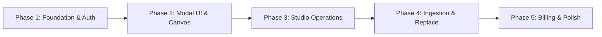

# mlsapi.dev WordPress Plugin Specification & Implementation Plan

> **WordPress plugin for real estate websites to use the `mlsapi.dev` Studio API for AI-powered architectural visualization, photo staging, and enhancement.**

---

## 1. Executive Summary & Objective

The **mlsapi.dev WordPress Plugin** brings the generative AI media capabilities of `mlsapi.dev` directly into the WordPress dashboard. 

Using an in-dashboard modal interface inspired by the `screenglow` editor pattern, real estate agents, property managers, webmasters, and content creators can select any image from the WordPress Media Library (or upload/paste directly) and execute AI transformations. 

When a job completes, the plugin retrieves the high-resolution output from the `mlsapi.dev` global CDN and allows the user to either:
1. **Save as a new Media Library attachment** (complete with thumbnails and metadata),
2. **Replace the existing image attachment in-place** (cache-busted and regenerated), or
3. **Download locally**.

---

## 2. Supported AI Operations (Studio API Mapping)

All visual operations connect to the `mlsapi.dev` Studio API (`/v1/studio/*`):

| Studio Tool | API Endpoint | Description & Options |
|---|---|---|
| **Room Staging** | `POST /v1/studio/staging/stage` | Furnish vacant room photos. Select from 29 design styles (*modern, luxury, scandinavian, farmhouse, etc.*) and room types (*living room, bedroom, patio, etc.*). |
| **Dusk / Sky Replacement** | `POST /v1/studio/staging/twilight`<br>`POST /v1/studio/enhance/exterior` | Day-to-dusk twilight conversion with warm glowing interior windows and landscape lighting, or crisp blue sky replacement. |
| **Room Declutter** | `POST /v1/studio/staging/declutter` | Remove tenant clutter, cords, boxes, and mess while strictly preserving room architecture and primary furniture. |
| **Room Empty (De-Staging)** | `POST /v1/studio/staging/empty` | Strip furnished rooms to empty architectural space; optionally restore bare flooring (*hardwood, tile, concrete*). |
| **Change Style (Restyling)** | `POST /v1/studio/staging/restyle` | Re-theme furnished rooms to a different aesthetic while retaining the spatial layout. |
| **Replace Furniture** | `POST /v1/studio/staging/replace-furniture` | Target specific furniture items (*sofa, coffee table, bed, etc.*) and replace them with a reference product image or text prompt. |
| **Change Paint Color** | `POST /v1/studio/staging/wall-colors` | Resurface walls with curated architectural paint colors or generate a 3x3 designer swatch comparison grid. |
| **Replace Materials** | `POST /v1/studio/staging/replace-material` | Resurface floors, countertops, cabinetry, or backsplash using texture sample images or material presets (*marble, quartz, white oak, etc.*). |
| **2D Blueprint to 3D Image** | `POST /v1/studio/floorplan/render-3d` | Transform architectural 2D floor plans, blueprints, or sketches into 3D isometric cutaway dollhouse renders. |
| **Ad & Creative Generation** | `POST /v1/studio/creatives/generate` | Generate branded Just Listed / Open House social banners (1:1, 9:16), carousel story cards, and printable PDF flyers from MLS property data. |
| **Photo Enhancement & 4K** | `POST /v1/studio/enhance/exterior`<br>`POST /v1/studio/enhance/upscale` | Outdoor enhancements (*green grass, pool cleaning, garden tidying*) and 4K super-resolution detail enhancement. |

---

## 3. Answers to Open Questions

### Q1: Authentication — Settings to enter API Key?
* **Decision: Yes, dedicated admin settings tab.**
* Store the API Key securely in WordPress options (`mlsapi_api_key`) with sanitization and masking (`sk_live_••••••••1234`).
* Provide a **"Verify & Test Connection"** AJAX action that performs a lightweight ping to the API (`GET /api/keys` or `GET /api/billing/overview`) to validate the key immediately upon entry.
* Support environment selection: `live` (Production) vs `test` (Playground/Sandbox).
* Allow setting an optional custom API Base URL (`mlsapi_api_base_url`, defaulting to `https://api.mlsapi.dev`) to facilitate local/staging development.

### Q2: mlsapi.dev Page — Show Usage and Billing?
* **Decision: Yes, dedicated "Dashboard & Billing" view in WP Admin.**
* Integrated under **Tools > MLS API Studio** or top-level menu **MLS API**:
  * **Workspace Overview:** Workspace Name, Plan Tier (*Starter / Pro / Scale / Enterprise*), Account Status.
  * **Credit Meter:** Real-time visual progress bar showing monthly allowance, credits used, credits remaining, and top-up balance.
  * **30-Day Activity Chart / Breakdown:** Endpoint consumption summary (Staging vs Twilight vs Enhancements).
  * **Direct Action:** "Manage Subscription & Buy Credits" button deep-linking to the Stripe Customer Portal / mlsapi.dev webapp.

---

## 4. Architecture & User Experience (ScreenGlow Modal Pattern)

The plugin adopts the lightweight, non-blocking modal architecture pioneered in `screenglow`:

```
┌────────────────────────────────────────────────────────────────────────┐
│  WordPress Admin / Media Library                                      │
│                                                                        │
│  [ Media Grid ]   [ Upload ]   [ ✨ MLS Studio AI Edit ]              │
│                                                                        │
│  ┌──────────────────────────────────────────────────────────────────┐  │
│  │  MLS API Studio Modal Window                                     │  │
│  │  ┌─────────────────────────┬──────────────────────────────────┐  │  │
│  │  │  Left Tool Selector     │  Center: Interactive Canvas      │  │  │
│  │  │  • Staging              │  ┌────────────────────────────┐  │  │
│  │  │  • Dusk / Twilight      │  │                            │  │  │
│  │  │  • Declutter            │  │   Before / After           │  │  │
│  │  │  • Empty Room           │  │   Interactive Split Slider │  │  │
│  │  │  • Style Restyle        │  │                            │  │  │
│  │  │  • Replace Furniture    │  │                            │  │  │
│  │  │  • Paint Color          │  └────────────────────────────┘  │  │
│  │  │  • Replace Materials    │  [ Live Async Progress Bar ]     │  │  │
│  │  │  • Blueprint to 3D      │                                  │  │  │
│  │  │  • Ad Creatives         ├──────────────────────────────────┤  │  │
│  │  │  • Photo Enhance (4K)   │  Actions & Output Controls       │  │  │
│  │  ├─────────────────────────┤  Format: [ WebP / PNG / JPG ]    │  │  │
│  │  │  Parameter Controls     │  [ Save as New ]                 │  │  │
│  │  │  • Style: [ Modern ▼ ]  │  [ Replace Original Image ]      │  │  │
│  │  │  • Room: [ Living ▼ ]   │  [ Download File ]               │  │  │
│  │  │  [ ✨ Generate Asset ]  │                                  │  │  │
│  │  └─────────────────────────┴──────────────────────────────────┘  │  │
│  └──────────────────────────────────────────────────────────────────┘  │
└────────────────────────────────────────────────────────────────────────┘
```

### 4.1 Entrypoints in WordPress
1. **Media Library Button:** "MLS Studio AI" button added to `upload.php` action toolbar.
2. **Media Modal Tab:** Custom "MLS Studio" tab inside the standard WordPress Media Upload modal (usable in Gutenberg, Classic Editor, Elementor, and custom themes).
3. **Single Attachment Action:** "Edit with MLS Studio" button on single media edit screens (`post.php?post=<id>&action=edit`).
4. **Admin Bar Quick Link:** Convenient top-bar button when viewing an image attachment on the frontend or backend.
5. **Direct Clipboard Paste:** Support pasting image data directly into the dashboard when the modal is open.

### 4.2 Async Job Polling & Realtime Feedback
Because generative AI models take between 8 to 25 seconds:
1. Frontend makes a WordPress AJAX call to `mlsapi_dispatch_studio_job`.
2. WordPress backend passes the request to `https://api.mlsapi.dev/v1/studio/*` with the stored API key, returning a `job_id` and `202 Accepted`.
3. The modal UI enters an animated loading state showing the active step (*e.g., "Analyzing spatial layout...", "Rendering high-res lighting..."*).
4. The client polls the internal WP AJAX proxy `mlsapi_poll_studio_job` (which checks `GET /v1/studio/jobs/:jobId`), or listens to Server-Sent Events where supported.
5. Upon completion, the result image is loaded into a **Before/After split comparison slider**.

### 4.3 Asset Ingestion & Storage
When the user clicks **"Save to Media Library"**:
1. WordPress backend securely downloads the CDN image (`wp_remote_get` with validation).
2. Saved via `WP_Filesystem` into the WordPress `wp-content/uploads/` hierarchy.
3. Automatically registers attachment in `wp_posts`, generates all standard thumbnail sizes via `wp_generate_attachment_metadata()`, and attaches custom metadata (`_mlsapi_source_job_id`, `_mlsapi_operation_type`).
4. In **Replace Mode**, the existing attachment file is cleanly overwritten, caches flushed (`clean_attachment_cache`), and thumbnail sizes refreshed.

---

## 5. Technical Architecture & File Structure

```text
mlsapi-wordpress/
├── assets/
│   ├── css/
│   │   ├── admin-modal.css         # Studio modal styling & responsive layout
│   │   ├── compare-slider.css      # Before/after interactive comparison viewer
│   │   └── settings.css            # Settings & billing dashboard styling
│   ├── js/
│   │   ├── mlsapi-modal.js         # Core modal lifecycle & state controller
│   │   ├── studio-client.js        # API dispatcher & async job polling engine
│   │   ├── compare-slider.js       # Before/after visual slider handler
│   │   └── settings-page.js        # API key verification & charts
│   └── img/
│       ├── icon.svg                # Brand plugin icon
│       └── tools/                  # Tool selector SVGs (staging, dusk, etc.)
├── includes/
│   ├── class-mlsapi-admin.php      # Admin scripts enqueuing, menu & modal injection
│   ├── class-mlsapi-api-client.php # PHP HTTP client for api.mlsapi.dev requests
│   ├── class-mlsapi-ajax.php       # WP AJAX handlers (job dispatch, polling, save image)
│   ├── class-mlsapi-settings.php   # Settings & Account/Billing dashboard page
│   ├── class-mlsapi-media.php      # Attachment replacement & WP Media hooks
│   └── templates/
│       ├── modal-editor.php        # HTML markup for the Studio editor modal
│       ├── settings-page.php       # HTML markup for settings & API key config
│       └── billing-dashboard.php   # HTML markup for credit usage & plan status
├── mlsapi.php                      # Main plugin bootstrap & constants
└── readme.txt                      # WP.org compliant readme & changelog
```

---

## 6. Detailed Implementation Plan



### Phase 1: Plugin Foundation & Secure Configuration
- [ ] Bootstrap `mlsapi.php` with requirements check (PHP 7.4+, WP 6.0+).
- [ ] Implement `MLSAPI_Settings` with options for `mlsapi_api_key`, `mlsapi_api_base_url`, `mlsapi_default_format`.
- [ ] Implement `MLSAPI_Api_Client` wrapper using `wp_remote_post` / `wp_remote_get` with standard `Authorization: Bearer <token>` and `x-api-key` headers.
- [ ] Build AJAX-based "Test API Connection" validation check on settings save.

### Phase 2: Editor Modal & Media Integration
- [ ] Build `modal-editor.php` UI layout containing tool sidebar, preview area, and action footer.
- [ ] Hook modal into Media Library (`upload.php`), single attachment editor, and admin bar.
- [ ] Implement image source loader (load active attachment URL or accept drag-and-drop/paste).
- [ ] Implement interactive before/after image comparison slider.

### Phase 3: Studio API Client & Operation Panels
- [ ] Build dynamic parameter panels in the modal for each operation:
  - **Staging / Restyle:** Style picker dropdown (29 presets), Room type selector.
  - **Dusk / Sky:** Mode toggles (Day-to-Dusk, Blue Sky).
  - **Declutter & Empty:** Surface retention, floor restoration options.
  - **Replace Furniture & Materials:** Reference image upload/picker + target selection.
  - **Paint Colors:** Swatch selection or 3x3 comparison grid view.
  - **2D to 3D Blueprint:** Blueprint upload + dollhouse style.
  - **Ad Generation:** Aspect ratio picker (1:1, 9:16), headline, MLS ID lookup.
- [ ] Build frontend polling loop against `mlsapi_poll_studio_job` with animated progress states and graceful error handling.

### Phase 4: Media Library Ingestion & Attachment Replacement
- [ ] Implement `mlsapi_save_image` AJAX endpoint:
  - Download remote CDN URL via `wp_remote_get`.
  - Validate image format and MIME integrity.
  - Save file to `/wp-content/uploads/` using `WP_Filesystem`.
  - Create WP attachment with metadata or execute in-place replacement.
  - Run `wp_generate_attachment_metadata()` to generate all theme thumbnail sizes.
  - Fire developer action hooks (`mlsapi_image_created`, `mlsapi_image_replaced`).

### Phase 5: Billing Dashboard, Permissions & Release Polish
- [ ] Build "Dashboard & Billing" screen fetching `/api/billing/overview`:
  - Show real-time monthly credit usage, top-up balance, and active tier.
  - Display quick-links to upgrade or purchase additional credits.
- [ ] Add role-based capability checks (`upload_files`, `edit_posts`, or custom capability).
- [ ] Responsive design adjustments for tablet and laptop screen resolutions.
- [ ] Code sanitization, escaping, and security audits (`wp_nonce_field`, `check_admin_referer`).
- [ ] Final testing against live `mlsapi.dev` API endpoints.

---

## 7. Security, Performance & Error Handling

1. **Security Standards:**
   - Strict nonce verification on all AJAX handlers (`check_ajax_referer`).
   - Capability enforcement: `current_user_can('upload_files')` for generation and `current_user_can('edit_post', $id)` for image replacement.
   - API keys stored in `wp_options` are never exposed to the frontend JavaScript client; all API calls are proxied through WordPress backend AJAX handlers.
   - URL validation (`wp_http_validate_url`) on all CDN download links before fetching binaries.

2. **Performance & Caching:**
   - Async job polling offloads heavy AI processing to background worker threads on `mlsapi.dev`.
   - Before/after images are rendered client-side using CSS masking / lightweight canvas to avoid unnecessary server load.
   - Media replacement calls `clean_attachment_cache()` and updates timestamp hashes to ensure browser and CDN cache invalidation.

3. **Error Resilience:**
   - Graceful UI failure states with human-readable error messages from the API.
   - Polling timeout guards (maximum 120 seconds) with retry prompt.
   - Fallback if temporary file write or thumbnail generation encounters server permission issues.
